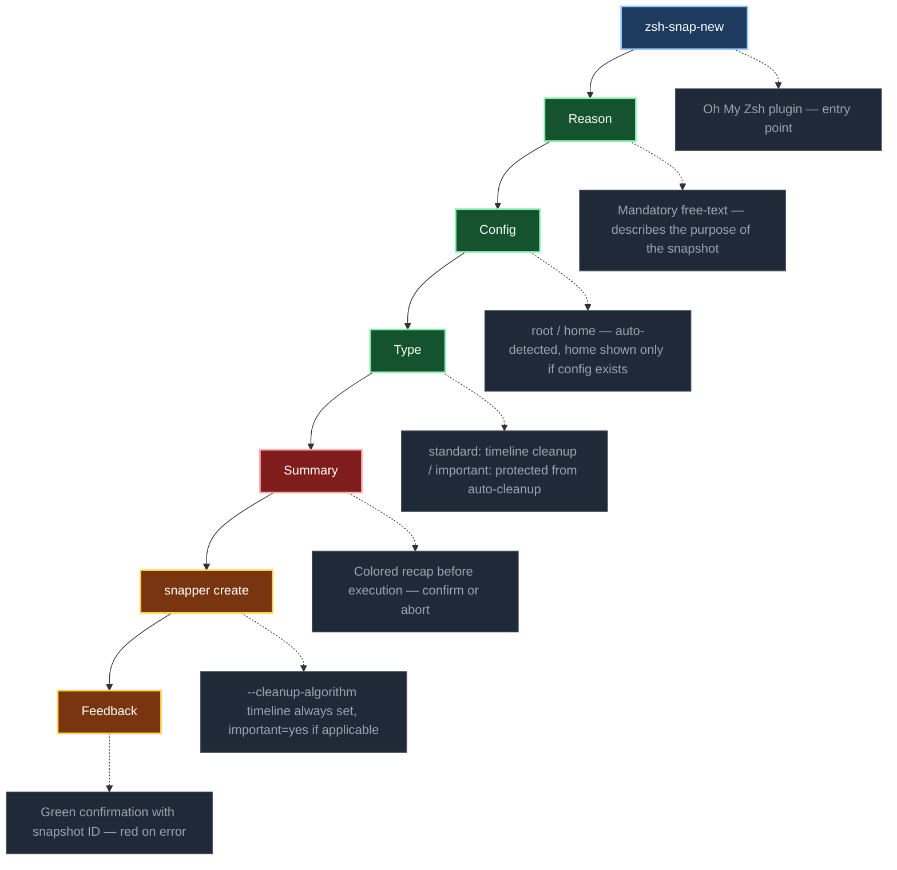

[](https://github.com/crisis1er/zsh-snap-new)


# zsh-snap-new

`snapper create` is powerful but unforgiving. Two silent mistakes break your safety net:

- Omitting `--cleanup-algorithm timeline` → the snapshot is **never cleaned up automatically**, filling your disk over time
- Omitting `--userdata important=yes` on a critical snapshot → **it gets silently rotated away** by snapper's number/timeline policies

`snap-new` makes both mistakes impossible. It replaces the raw command with a guided flow: a **14-scenario table** pre-fills the description and suggests the right type (standard vs important) based on what you are about to do. Before executing, it checks disk usage, shows existing snapshot context, and asks for confirmation. `--cleanup-algorithm timeline` is always set — you cannot forget it.

Deployed and validated on a live openSUSE Tumbleweed system.

---

## Architecture

<sub>⚠️ If the diagram is not visible, refresh the page — Mermaid rendering may take a moment.</sub>



---

## Features

### 14-scenario table with smart type suggestion
Instead of typing a free description, choose from a pre-built table of 14 common scenarios split into two columns — Important and Standard. The type (standard vs important) is **automatically pre-selected** based on the scenario. Choosing "Before system update" defaults to important; "Routine checkpoint" defaults to standard. For custom free-text reasons, keywords like `update`, `kernel`, `downgrade`, `security`, `migration` trigger the important default automatically.

### Dual-config support — root, home, or both in one command
If a `home` snapper config is detected on the system, a third option appears: **both** — creating snapshots for root and home in a single command. If no home config exists, the prompt is skipped entirely. No manual `-c` flag required.

### Disk space check before creation
Before any snapshot is created, `snap-new` checks filesystem usage on `/`. If usage exceeds **85%**, a warning is displayed with the exact percentage and a confirmation is required to proceed. Prevents silently worsening space pressure on a nearly full system.

### Snapshot context display
Before the type and confirmation prompts, `snap-new` shows the **current state** of each target config: total snapshot count, last snapshot ID, description, type, and date. You know exactly what exists before adding a new snapshot.

### Forced `--cleanup-algorithm timeline`
Every snapshot created by `snap-new` includes `--cleanup-algorithm timeline`. This ensures snapper's automatic rotation policies apply — the snapshot will be cleaned up according to your configured timeline rules. Omitting this flag with raw `snapper create` leaves orphan snapshots that accumulate indefinitely.

### Protected snapshots with `important=yes`
When type **important** is selected, `--userdata important=yes` is added. Snapper's number and timeline cleanup algorithms skip snapshots carrying this flag — they are protected from automatic rotation until explicitly deleted. Critical snapshots before major changes are never silently removed.

### Colored confirmation summary before execution
Before calling `snapper`, a recap is displayed: config, type (color-coded green/yellow), and reason. The user confirms with `y` or aborts with `N`. Nothing is created until explicit confirmation.

### Feedback with previous and new snapshot IDs
After creation, the output shows both the **new snapshot ID** and the **previous snapshot ID**, for each config. Makes it immediately clear what was created and what the rollback reference point is.

---

## Requirements

- openSUSE Tumbleweed
- zsh 5.9+
- [Oh My Zsh](https://ohmyz.sh/)
- `snapper` — `sudo zypper install snapper`
- Snapper configured with at least one config (`root`, optionally `home`)

---

## Installation

```zsh
git clone https://github.com/crisis1er/zsh-snap-new \
  ${ZSH_CUSTOM:-~/.oh-my-zsh/custom}/plugins/snap-new
```

Add `snap-new` to the plugins list in `~/.zshrc`:

```zsh
plugins=(... snap-new)
```

Reload:

```zsh
source ~/.zshrc
```

---

## Usage

```zsh
snap-new
```

The function runs a guided flow:

```
╔══════════════════════════════════════════════════════════════╗
║              Snap-New — SafeITExperts                        ║
║              Guided Snapshot Creation                        ║
╠══════════════════════════════════════════════════════════════╣
║  You are about to create a snapshot of your system.          ║
║  → Choose Important if you're about to make a significant    ║
║    change (update, install, config, downgrade)               ║
║  → Choose Standard for routine checkpoints                   ║
╚══════════════════════════════════════════════════════════════╝

┌───────────────────────────────┬──────────────────────────────┐
│  Important                    │  Standard                    │
├───────────────────────────────┼──────────────────────────────┤
│  1. Before system update      │  8. Routine checkpoint       │
│  2. Before kernel change      │  9. After successful test    │
│  3. Before pkg install/removal│ 10. Clean state              │
│  4. Before downgrade          │ 11. Weekly snapshot          │
│  5. Before config change      │ 12. Monthly snapshot         │
│  6. Before migration          │ 13. After update verified    │
│  7. Security update           │ 14. Before testing           │
└───────────────────────────────┴──────────────────────────────┘
     0.  Custom — type your own reason

Choice [0-14] : 1

Config:
  (r) root
  (h) home
  (b) both
Choice [rhb] (default: r) : r

Current state:
  root — 24 snapshot(s) — last: #24 "Routine checkpoint" [single, standard] (2026-04-05 18:32)

Type:
  (s) Standard  — automatic timeline cleanup
  (i) Important — protected from automatic cleanup
  → Suggested: important (based on selected scenario)
Choice [si] (default: i) :

Summary:
  Config  : root
  Type    : important
  Reason  : Before system update (zypper dup)

Confirm? [y/N] : y

✓ Snapshot #25 created [root] — important — "Before system update (zypper dup)" (previous: #24)
```

---

## Design decisions

- **No argument** — fully interactive, no risk of forgetting the description
- **`--cleanup-algorithm timeline`** always set — snapshots are managed automatically unless marked `important=yes`
- `important=yes` userdata protects the snapshot from automatic cleanup by snapper's number/timeline algorithms
- `function name { }` syntax — prevents zsh alias/function conflicts on shell reload
- Config `home` prompt appears only if the config actually exists on the system
